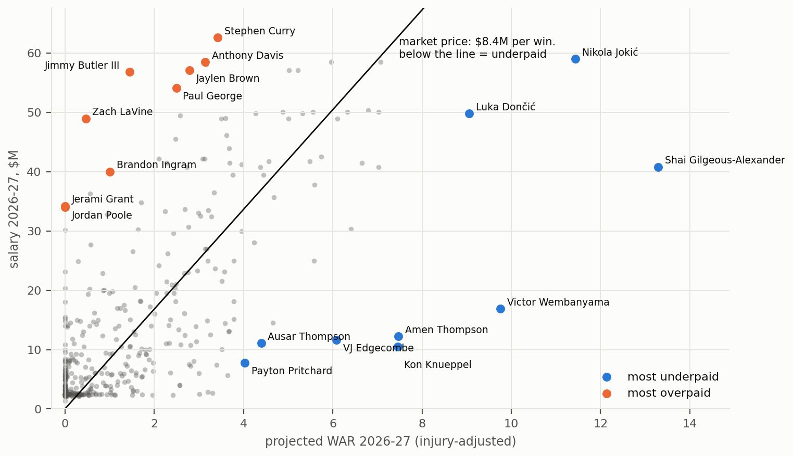

# NBA Moneyball

What is each NBA player actually worth, compared to what he gets paid?

**[Read the report (PDF, 14 pages)](report/nba_moneyball_report.pdf)**

**[Case study: How do we get Bron his last ring? (PDF, 9 pages)](report/phi_case_last_ring.pdf)**, the trades that give the 2026-27 76ers the best title odds

Every player is priced in wins and compared with his contract. Player impact comes from RAPM with a box-score prior,
projected forward with an aging curve and an injury-risk model, turned into wins above replacement (WAR) by
calibrating on team results, and priced at what the market paid per win: about $7.7M in 2025-26. Last season's
player values predict team wins with a correlation of 0.79. Free data only, seasons 2010-11 to 2025-26.



Main findings:

- Players peak at 28, and offense fades faster than defense.
- Injury proneness is real and predictable (top fifth of injury history misses 21 games next season, bottom fifth 7),
  but players who come back are as good as before. The exception is the ACL: the first 20 games back are about
  0.5 to 0.8 points per 100 worse.
- The biggest surpluses sit on young players on rookie or early extension deals. Only 7 of the 27 players paid $45M
  or more project to earn their salary next season.
- Three-point volume went from underpaid to overpaid around 2019-20, but what the market really overpays is scoring.
  Accurate shooters are the bargain.
- Defense does not win championships: in the playoffs a point of defensive edge is worth no more than a point of
  offensive edge.

The 2026-27 projections are frozen in [forecasts/2026-27](forecasts/2026-27) before the season, to be tested
against what happens (see Forward test below).

Play-by-play from [shufinskiy/nba_data](https://github.com/shufinskiy/nba_data) (stats.nba.com v3 format),
rosters, minutes and box scores from stats.nba.com via nba_api, injuries from ProSportsTransactions and the
official NBA injury reports, salaries and contracts from basketball-reference.com.

## Plan

1. Pull play-by-play and split every game into stints (same 10 players on the floor)
2. RAPM: ridge regression of stint margin on who was playing
3. Box-prior RAPM: shrink towards a box score estimate instead of zero (box_prior.py)
4. Convert to wins
5. Aging curve, to project future wins
6. Injury discount
7. Join salaries, compute surplus value (projected value minus salary)
8. Sub-questions: are three-point shooters overpaid? does defense win championships? MVP votes vs RAPM

## Setup

```
pip install -r requirements.txt
python src/check_api.py     # stats.nba.com answers?
python src/ingest.py        # raw pbp + rosters -> data/raw
python src/lineups.py       # stints -> data/processed
python src/rapm.py          # O/D RAPM per season
python src/players.py       # ages, box scores, team schedules (nba_api)
python src/box_prior.py     # RAPM again, shrunk towards a box-score prior (plain kept in rapm_plain)
python src/aging.py         # aging curve -> figures/aging_curve.png
python src/draft.py         # draft history 2010-, nba_api (your own machine), value.py uses it
python src/value.py         # blended, age-adjusted value + backtest of the blend
python src/mvp.py           # side quest: MVP votes vs RAPM

python src/injuries_pst.py       # injury log 2010-11..2019-20 (prosportstransactions, pre-scraped)
python src/injury_reports.py     # official NBA injury report PDFs 2021-22.. (download)
python src/injury_reports.py --parse   # pdfs -> rows
python src/scrape_salaries.py    # salaries + contracts, basketball-reference.com (~30 min, cached)
python src/rosters.py            # who plays where now (nba.com): the rest of a bought-out contract = dead money
python src/availability.py       # games missed + games lost to injury per player-season
python src/injury.py             # injury proneness + risk model -> figures/injury_proneness.png
python src/injury_types.py       # which injury types hurt the future -> figures/injury_types.png
python src/injury_windows.py     # same, in 82/20-game windows around each injury -> figures/injury_windows.png
python src/current_injuries.py   # who ended the season still hurt: remaining games + rust -> updates injury_risk
python src/war.py                # calibrated value -> projected WAR for next season
python src/surplus.py            # $ per WAR, surplus over the remaining contract, options valued (options.py)
python src/threes.py             # side quest: are 3-point shooters overpaid? -> figures/threes.png
python src/playoffs.py           # playoff results (same pbp archive)
python src/defense.py            # side quest: does defense win championships? -> figures/defense.png
python src/rookies.py            # rookie model: value + minutes by pick, young-player bump, pick value -> figures/rookies.png
python src/season_sim.py         # 10,000 seasons: playoff / Finals / title odds + the win value curve
python src/market_value.py       # what the market pays: new contracts ~ box score (Tobit), market surplus, pick value
python src/scrape_transactions.py  # every trade since 2011-12, bbref (your own machine)
python src/trade_value.py        # what real trades say a pick costs, in the market's money
python src/playoff_stints.py     # playoff play-by-play -> stints (same archive)
python src/playoff_rotation.py   # playoff minute shares by rank: shorter rotations -> season_sim uses them
python src/positions.py          # box-score roles + what lineups without bigs / guards cost -> season_sim
python src/season_sim.py         # rerun with playoff rotations and lineup shapes
python src/arbitrage.py          # who predicts team wins better: payroll, the market's price or our model
python src/trade_search.py       # PHI case: best legal trades the other side accepts at market prices (~30 min)
python report/make_case_figures.py && python report/build_case.py   # the PHI case PDF
```

## Forward test

Before a season starts, freeze the projections and commit them; the commit time is the proof they came first.
During or after the season, check them against what happened (teams, stints, availability, each vs a simple baseline).

```
python src/freeze.py                 # -> forecasts/2026-27/ (players.csv, teams.csv, meta.json with sha256)
python src/freeze.py --version v2    # -> forecasts/2026-27-v2/, after season_sim.py, teams with playoff / title odds
git add forecasts
git commit -m "freeze 2026-27 forecast"

# once the season has started. for a fresh pull, first delete the 2026 raw files:
# Remove-Item data\raw\pbp_2026.parquet, data\raw\roster_2026.parquet, data\raw\players_2026.parquet, data\raw\team_games_2026.parquet
python src/ingest.py --seasons 2026
python src/players.py --seasons 2026
python src/lineups.py --seasons 2026
python src/forward_test.py
```

stats.nba.com blocks most cloud IPs, so run the roster pulls from your own machine.
Set NBA_DATA_DIR to keep the data folder somewhere else.
